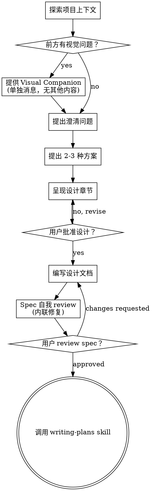

# 将想法 Brainstorm 成设计

通过自然的协作对话，帮助把想法转化成完整设计和 spec。

先理解当前项目上下文，然后一次问一个问题来细化想法。当你理解要构建什么后，呈现设计并获得用户批准。

<HARD-GATE>
在你呈现设计并获得用户批准之前，不要调用任何实现 skill，不要写任何代码，不要 scaffold 任何项目，也不要采取任何实现行动。无论项目看起来多简单，这都适用于每个项目。
</HARD-GATE>

## 反模式："This Is Too Simple To Need A Design"

每个项目都要经过这个流程。Todo list、单函数工具、配置变更，全部如此。"简单"项目最容易因为未检查的假设浪费工作。设计可以很短（真正简单的项目几句话即可），但你必须呈现它并获得批准。

## Checklist

你必须为以下每项创建任务，并按顺序完成：

1. **探索项目上下文** - 检查文件、文档、recent commits
2. **提供视觉伴侣**（如果主题会涉及视觉问题）- 这是单独一条消息，不和澄清问题合并。见下方 Visual Companion 节。
3. **提出澄清问题** - 一次一个，理解目的/约束/成功标准
4. **提出 2-3 种方案** - 带 trade-offs 和你的推荐
5. **呈现设计** - 按复杂度拆分章节，逐节获得用户批准
6. **编写设计文档** - 保存到 `docs/superpowers/specs/YYYY-MM-DD-<topic>-design.md` 并 commit
7. **Spec 自我 review** - 快速 inline 检查 placeholder、矛盾、歧义、范围（见下）
8. **用户 review 书面 spec** - 继续前请用户 review spec 文件
9. **转入实现** - 调用 writing-plans skill 创建实现计划

## 流程图

**终止状态是调用 writing-plans。**不要调用 frontend-design、mcp-builder 或任何其他实现 skill。Brainstorming 后唯一调用的 skill 是 writing-plans。

## 流程

**理解想法：**

- 先查看当前项目状态（文件、文档、recent commits）
- 提详细问题前先评估范围：如果请求描述了多个独立子系统（例如 "build a platform with chat, file storage, billing, and analytics"），立即指出。不要花问题细化一个本该先拆分的项目。
- 如果项目太大，无法用一份 spec 覆盖，帮助用户拆成子项目：独立部分是什么、彼此如何关联、应该按什么顺序构建？然后按正常设计流程 brainstorm 第一个子项目。每个子项目都有自己的 spec -> plan -> implementation cycle。
- 对范围合适的项目，一次问一个问题来细化想法
- 尽可能优先用多选问题，但开放问题也可以
- 每条消息只问一个问题；如果一个主题需要更多探索，拆成多个问题
- 聚焦理解：目的、约束、成功标准

**探索方案：**

- 提出 2-3 种不同方案，带 trade-offs
- 以对话方式呈现选项，并给出你的推荐和理由
- 先给推荐方案并解释原因

**呈现设计：**

- 一旦你认为理解了要构建什么，就呈现设计
- 每节按复杂度缩放：简单时几句话，复杂时最多 200-300 词
- 每节之后询问目前看起来是否正确
- 覆盖：architecture、components、data flow、error handling、testing
- 如果某些内容说不通，随时回去澄清

**为隔离和清晰而设计：**

- 把系统拆成更小的单元。每个单元都有一个明确目的，通过定义良好的接口通信，并且能独立理解和测试
- 对每个单元，你应该能回答：它做什么、怎么使用、依赖什么？
- 不读内部实现时，别人能理解一个单元做什么吗？你能修改内部而不破坏消费者吗？如果不能，边界需要调整。
- 更小且边界清晰的单元也让你更容易工作。你更擅长推理能一次放进上下文的代码；文件聚焦时编辑也更可靠。当一个文件变大，通常说明它承担了太多职责。

**在现有代码库中工作：**

- 提出变更前先探索当前结构。遵循现有模式。
- 如果现有代码存在影响这项工作的缺陷（例如文件太大、边界不清、职责缠绕），把有针对性的改进纳入设计。这是优秀开发者在修改相关代码时会做的事。
- 不要提出无关重构。只关注服务当前目标的内容。

## 设计之后

**文档：**

- 把已验证的设计（spec）写入 `docs/superpowers/specs/YYYY-MM-DD-<topic>-design.md`
  - （用户对 spec 位置的偏好会覆盖这个默认值）
- 如果可用，使用 elements-of-style:writing-clearly-and-concisely skill
- 将设计文档 commit 到 git

**Spec 自我 Review：**
写完 spec 文档后，用新鲜视角审视它：

1. **Placeholder 扫描：**是否有 "TBD"、"TODO"、未完成章节或含糊要求？修复它们。
2. **内部一致性：**各章节是否互相矛盾？架构是否匹配功能描述？
3. **范围检查：**这是否足够聚焦，能用一份实现计划覆盖？还是需要拆分？
4. **歧义检查：**任何要求是否可能有两种解释？如果是，选定一种并明确写出。

直接修复发现的问题。无需重新 review，修好继续。

**用户 Review Gate：**
Spec review loop 通过后，请用户在继续前 review 书面 spec：

> "Spec written and committed to `<path>`. Please review it and let me know if you want to make any changes before we start writing out the implementation plan."

等待用户回复。如果用户要求修改，完成修改并重新运行 spec review loop。只有用户批准后才能继续。

**实现：**

- 调用 writing-plans skill 创建详细实现计划
- 不要调用任何其他 skill。writing-plans 是下一步。

## 关键原则

- **一次一个问题** - 不要用多个问题压倒用户
- **优先多选** - 在可能时比开放问题更容易回答
- **严格 YAGNI** - 从所有设计中移除不必要功能
- **探索替代方案** - 确定方案前始终提出 2-3 种方案
- **增量验证** - 呈现设计，先获得批准再继续
- **保持灵活** - 当某些内容说不通时，回头澄清

## Visual Companion

用于在 brainstorming 期间展示 mockups、diagrams 和视觉选项的浏览器伴侣。它是一个工具，不是一种模式。接受 companion 表示它可用于适合视觉处理的问题；这不意味着每个问题都通过浏览器处理。

**提供 companion：**当你预期接下来的问题会涉及视觉内容（mockups、layouts、diagrams）时，先请求一次同意：
> "Some of what we're working on might be easier to explain if I can show it to you in a web browser. I can put together mockups, diagrams, comparisons, and other visuals as we go. This feature is still new and can be token-intensive. Want to try it? (Requires opening a local URL)"

**这个 offer 必须是单独消息。**不要把它与澄清问题、上下文摘要或任何其他内容合并。消息应该只包含上面的 offer，不含其他内容。等待用户回复后再继续。如果用户拒绝，继续纯文本 brainstorming。

**逐问题决策：**即使用户接受，也要对每个问题决定使用浏览器还是终端。测试标准是：**用户看见它是否比阅读它更容易理解？**

- **使用浏览器**处理真正视觉化的内容：mockups、wireframes、layout comparisons、architecture diagrams、side-by-side visual designs
- **使用终端**处理文本内容：requirements questions、conceptual choices、tradeoff lists、A/B/C/D text options、scope decisions

关于 UI 主题的问题不自动等于视觉问题。"What does personality mean in this context?" 是概念问题，使用终端。"Which wizard layout works better?" 是视觉问题，使用浏览器。

如果用户同意 companion，继续前阅读详细指南：
`skills/brainstorming/visual-companion.md`
