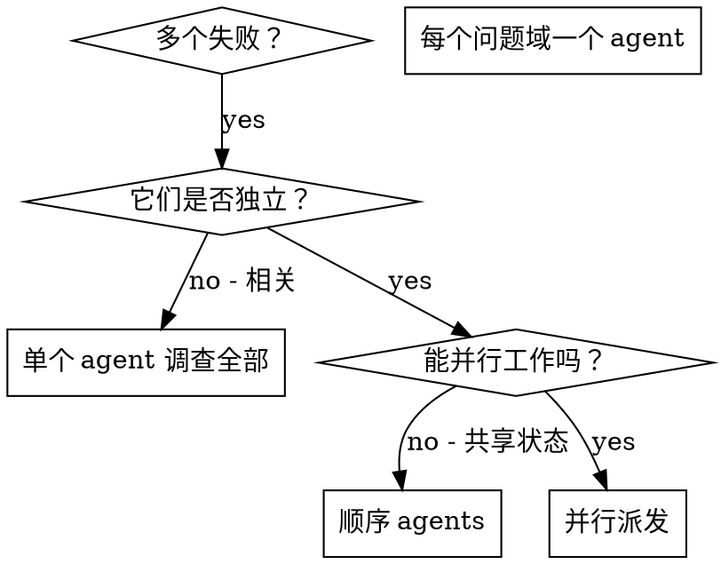

# 派发并行 Agents

## 概览

你把任务委派给具有隔离上下文的专门 agents。通过精准构造它们的指令和上下文，确保它们保持专注并完成任务。它们绝不应该继承你当前会话的上下文或历史；你要只构造它们需要的内容。这也能保留你自己的上下文，用于协调工作。

当你遇到多个互不相关的失败（不同测试文件、不同子系统、不同 bug）时，顺序调查会浪费时间。每个调查都是独立的，可以并行发生。

**核心原则：**每个独立问题域派发一个 agent。让它们并发工作。

## 何时使用



**使用场景：**
- 3 个以上测试文件失败，且根因不同
- 多个子系统独立损坏
- 每个问题都可以在不依赖其他问题上下文的情况下理解
- 各调查之间没有共享状态

**不要使用：**
- 失败彼此相关（修复一个可能修复其他）
- 需要理解完整系统状态
- Agents 会相互干扰

## 模式

### 1. 识别独立域

按损坏内容分组失败：
- 文件 A 测试：工具审批流程
- 文件 B 测试：批量完成行为
- 文件 C 测试：Abort 功能

每个域都是独立的，修复工具审批不会影响 abort 测试。

### 2. 创建聚焦的 Agent 任务

每个 agent 得到：
- **具体范围：**一个测试文件或子系统
- **清晰目标：**让这些测试通过
- **约束：**不要修改其他代码
- **预期输出：**总结发现和修复内容

### 3. 并行派发

```typescript
// In Claude Code / AI environment
Task("Fix agent-tool-abort.test.ts failures")
Task("Fix batch-completion-behavior.test.ts failures")
Task("Fix tool-approval-race-conditions.test.ts failures")
// All three run concurrently
```

### 4. Review 并集成

Agents 返回后：
- 阅读每个总结
- 验证修复彼此不冲突
- 运行完整测试套件
- 集成所有变更

## Agent Prompt 结构

好的 agent prompts 具备：
1. **聚焦** - 一个明确的问题域
2. **自包含** - 包含理解问题所需的全部上下文
3. **明确输出** - agent 应返回什么？

```markdown
修复 src/agents/agent-tool-abort.test.ts 中的 3 个失败测试：

1. "should abort tool with partial output capture" - expects 'interrupted at' in message
2. "should handle mixed completed and aborted tools" - fast tool aborted instead of completed
3. "should properly track pendingToolCount" - expects 3 results but gets 0

这些是 timing/race condition 问题。你的任务：

1. 阅读测试文件并理解每个测试验证什么
2. 识别根因 - 是 timing 问题还是真实 bug？
3. 通过以下方式修复：
   - 用基于事件的等待替代任意 timeout
   - 如果发现 abort 实现中的 bug，修复它
   - 如果测试的是已变化行为，调整测试期望

不要只是增加 timeout，要找出真正问题。

返回：总结你发现了什么、修复了什么。
```

## 常见错误

**❌ 太宽泛：**"Fix all the tests" - agent 会迷失
**✅ 具体：**"Fix agent-tool-abort.test.ts" - 范围聚焦

**❌ 没有上下文：**"Fix the race condition" - agent 不知道在哪里
**✅ 有上下文：**粘贴错误信息和测试名

**❌ 没有约束：**Agent 可能重构所有东西
**✅ 有约束：**"Do NOT change production code" 或 "Fix tests only"

**❌ 输出含糊：**"Fix it" - 你不知道改了什么
**✅ 输出具体：**"Return summary of root cause and changes"

## 何时不要使用

**相关失败：**修复一个可能修复其他，先一起调查
**需要完整上下文：**理解问题需要看到整个系统
**探索式调试：**你还不知道坏在哪里
**共享状态：**Agents 会互相干扰（编辑相同文件、使用相同资源）

## 来自会话的真实示例

**场景：**一次大重构后，3 个文件里有 6 个测试失败

**失败：**
- agent-tool-abort.test.ts：3 个失败（timing 问题）
- batch-completion-behavior.test.ts：2 个失败（工具未执行）
- tool-approval-race-conditions.test.ts：1 个失败（execution count = 0）

**决策：**独立域 - abort 逻辑、批量完成、race conditions 彼此分离

**派发：**
```
Agent 1 -> Fix agent-tool-abort.test.ts
Agent 2 -> Fix batch-completion-behavior.test.ts
Agent 3 -> Fix tool-approval-race-conditions.test.ts
```

**结果：**
- Agent 1：用基于事件的等待替代 timeout
- Agent 2：修复事件结构 bug（threadId 放错位置）
- Agent 3：添加等待异步工具执行完成

**集成：**所有修复相互独立，无冲突，完整套件 green

**节省时间：**3 个问题并行解决，而不是顺序解决

## 关键收益

1. **并行化** - 多个调查同时进行
2. **聚焦** - 每个 agent 范围窄，需要跟踪的上下文更少
3. **独立性** - Agents 不会互相干扰
4. **速度** - 用解决 1 个问题的时间解决 3 个问题

## 验证

Agents 返回后：
1. **Review 每个总结** - 理解改了什么
2. **检查冲突** - agents 是否编辑了相同代码？
3. **运行完整套件** - 验证所有修复能一起工作
4. **抽查** - Agents 可能犯系统性错误

## 真实世界影响

来自调试会话（2025-10-03）：
- 3 个文件共 6 个失败
- 并行派发 3 个 agents
- 所有调查并发完成
- 所有修复成功集成
- Agent 变更之间零冲突
