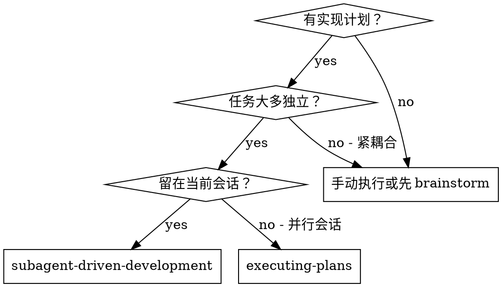
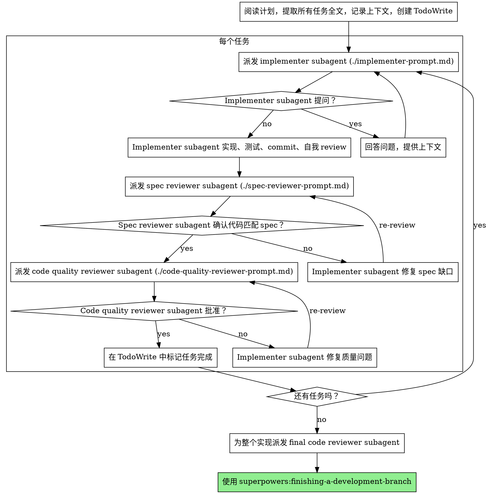

# Subagent-Driven Development

通过为每个任务派发 fresh subagent 执行计划，并在每个任务后进行两阶段 review：先做 spec compliance review，再做 code quality review。

**为什么使用 subagents：**你把任务委派给具有隔离上下文的专门 agents。通过精准构造它们的指令和上下文，确保它们保持专注并完成任务。它们绝不应该继承你当前会话的上下文或历史；你要只构造它们需要的内容。这也能保留你自己的上下文，用于协调工作。

**核心原则：**每个任务使用 fresh subagent + 两阶段 review（先 spec，后 quality）= 高质量、快速迭代

**连续执行：**不要在任务之间停下来向人工协作者确认。执行计划中的所有任务，不要停止。唯一停止理由是：你无法解决的 BLOCKED 状态、确实阻止推进的歧义，或所有任务完成。"Should I continue?" 提示和进度摘要会浪费他们的时间。他们让你执行计划，所以执行它。

## 何时使用



**相对 Executing Plans（并行会话）：**
- 同一会话（无上下文切换）
- 每个任务 fresh subagent（无上下文污染）
- 每个任务后两阶段 review：先 spec compliance，再 code quality
- 更快迭代（任务之间不需要 human-in-loop）

## 流程



## 模型选择

使用能胜任角色的最低能力模型，以节省成本并提升速度。

**机械实现任务**（隔离函数、清晰 spec、1-2 个文件）：使用快速、便宜的模型。计划写得好时，大多数实现任务都是机械的。

**集成和判断任务**（多文件协调、模式匹配、调试）：使用标准模型。

**架构、设计和 review 任务**：使用可用的最强模型。

**任务复杂度信号：**
- 触碰 1-2 个文件且 spec 完整 -> 便宜模型
- 触碰多个文件且有集成关注点 -> 标准模型
- 需要设计判断或广泛代码库理解 -> 最强模型

## 处理 Implementer 状态

Implementer subagents 会报告四种状态之一。按对应方式处理：

**DONE：**进入 spec compliance review。

**DONE_WITH_CONCERNS：**implementer 完成了工作，但标记了疑虑。继续前阅读这些 concerns。如果 concerns 涉及正确性或范围，在 review 前处理它们。如果只是观察（例如 "this file is getting large"），记下来并继续 review。

**NEEDS_CONTEXT：**implementer 需要未提供的信息。提供缺失上下文并重新派发。

**BLOCKED：**implementer 无法完成任务。评估阻塞点：
1. 如果是上下文问题，提供更多上下文并用同一模型重新派发
2. 如果任务需要更多推理，用更强模型重新派发
3. 如果任务太大，拆成更小块
4. 如果计划本身错误，升级给人工协作者

**绝不要**忽略升级，也不要在没有变化的情况下强迫同一模型重试。如果 implementer 说卡住了，就必须改变某些东西。

## Prompt 模板

- `./implementer-prompt.md` - 派发 implementer subagent
- `./spec-reviewer-prompt.md` - 派发 spec compliance reviewer subagent
- `./code-quality-reviewer-prompt.md` - 派发 code quality reviewer subagent

## 示例工作流

```
You: I'm using Subagent-Driven Development to execute this plan.

[一次性阅读计划文件：docs/superpowers/plans/feature-plan.md]
[提取全部 5 个任务的全文和上下文]
[用所有任务创建 TodoWrite]

Task 1: Hook installation script

[获取 Task 1 文本和上下文（已提取）]
[用完整任务文本 + 上下文派发 implementation subagent]

Implementer: "Before I begin - should the hook be installed at user or system level?"

You: "User level (~/.config/superpowers/hooks/)"

Implementer: "Got it. Implementing now..."
[稍后] Implementer:
  - Implemented install-hook command
  - Added tests, 5/5 passing
  - Self-review: Found I missed --force flag, added it
  - Committed

[派发 spec compliance reviewer]
Spec reviewer: ✅ Spec compliant - all requirements met, nothing extra

[获取 git SHAs，派发 code quality reviewer]
Code reviewer: Strengths: Good test coverage, clean. Issues: None. Approved.

[标记 Task 1 complete]

Task 2: Recovery modes

[获取 Task 2 文本和上下文（已提取）]
[用完整任务文本 + 上下文派发 implementation subagent]

Implementer: [无问题，继续]
Implementer:
  - Added verify/repair modes
  - 8/8 tests passing
  - Self-review: All good
  - Committed

[派发 spec compliance reviewer]
Spec reviewer: ❌ Issues:
  - Missing: Progress reporting (spec says "report every 100 items")
  - Extra: Added --json flag (not requested)

[Implementer 修复问题]
Implementer: Removed --json flag, added progress reporting

[Spec reviewer 再次 review]
Spec reviewer: ✅ Spec compliant now

[派发 code quality reviewer]
Code reviewer: Strengths: Solid. Issues (Important): Magic number (100)

[Implementer 修复]
Implementer: Extracted PROGRESS_INTERVAL constant

[Code reviewer 再次 review]
Code reviewer: ✅ Approved

[标记 Task 2 complete]

...

[所有任务完成后]
[派发 final code-reviewer]
Final reviewer: All requirements met, ready to merge

Done!
```

## 优势

**相比手动执行：**
- Subagents 会自然遵循 TDD
- 每个任务 fresh context（无混淆）
- 并行安全（subagents 不互相干扰）
- Subagent 可以提问（工作前和工作中都可以）

**相比 Executing Plans：**
- 同一会话（无需交接）
- 持续推进（无需等待）
- 自动 review 检查点

**效率收益：**
- 无文件阅读开销（controller 提供完整文本）
- Controller 精心挑选所需上下文
- Subagent 一开始就获得完整信息
- 问题会在工作前暴露（而不是之后）

**质量门：**
- 自我 review 在交接前抓问题
- 两阶段 review：spec compliance，然后 code quality
- Review loops 确保修复真的有效
- Spec compliance 防止过度/不足构建
- Code quality 确保实现构建良好

**成本：**
- 更多 subagent 调用（每个任务 implementer + 2 个 reviewers）
- Controller 做更多准备工作（预先提取所有任务）
- Review loops 增加迭代
- 但能早抓问题（比之后调试更便宜）

## 红旗

**绝不要：**
- 未经用户明确同意就在 main/master 分支上开始实现
- 跳过 review（spec compliance 或 code quality）
- 带着未修复问题继续
- 并行派发多个 implementation subagents（会冲突）
- 让 subagent 读取计划文件（直接提供全文）
- 跳过场景上下文（subagent 需要理解任务所在位置）
- 忽略 subagent 问题（先回答再让它继续）
- 接受 spec compliance 中的 "close enough"（spec reviewer 发现问题 = 未完成）
- 跳过 review loops（reviewer 发现问题 = implementer 修复 = 再 review）
- 让 implementer 自我 review 替代真实 review（两者都需要）
- **在 spec compliance ✅ 前开始 code quality review**（顺序错误）
- 任一 review 还有开放问题时进入下一个任务

**如果 subagent 提问：**
- 清晰、完整回答
- 如有需要，提供额外上下文
- 不要催它开始实现

**如果 reviewer 发现问题：**
- Implementer（同一个 subagent）修复它们
- Reviewer 再次 review
- 重复直到批准
- 不要跳过 re-review

**如果 subagent 任务失败：**
- 用具体指令派发 fix subagent
- 不要手动修复（上下文污染）

## 集成

**必需工作流 skills：**
- **superpowers:using-git-worktrees** - 确保隔离工作区（创建一个或验证当前已有）
- **superpowers:writing-plans** - 创建本 skill 执行的计划
- **superpowers:requesting-code-review** - reviewer subagents 的 code review 模板
- **superpowers:finishing-a-development-branch** - 所有任务完成后的开发收尾

**Subagents 应使用：**
- **superpowers:test-driven-development** - Subagents 为每个任务遵循 TDD

**替代工作流：**
- **superpowers:executing-plans** - 用于并行会话，而不是同会话执行
