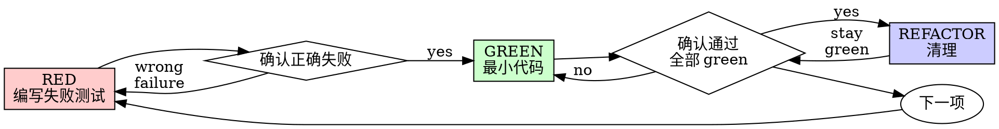

# 测试驱动开发（TDD）

## 概览

先写测试。看它失败。写最少代码让它通过。

**核心原则：**如果你没有看见测试失败，就不知道它是否测试了正确的东西。

**违反规则的字面要求，就是违反规则的精神。**

## 何时使用

**始终使用：**
- 新功能
- Bug 修复
- 重构
- 行为变更

**例外（询问你的人工协作者）：**
- 一次性原型
- 生成代码
- 配置文件

想到 "skip TDD just this once"？停止。那是在合理化。

## 铁律

```
没有先失败的测试，就不能写生产代码
```

测试前写了代码？删除它。重新开始。

**没有例外：**
- 不要把它保留为 "reference"
- 写测试时不要 "adapt" 它
- 不要看它
- 删除就是删除

从测试重新实现。就这样。

## Red-Green-Refactor



### RED - 编写失败测试

写一个最小测试，展示应该发生什么。

<Good>
```typescript
test('retries failed operations 3 times', async () => {
  let attempts = 0;
  const operation = () => {
    attempts++;
    if (attempts < 3) throw new Error('fail');
    return 'success';
  };

  const result = await retryOperation(operation);

  expect(result).toBe('success');
  expect(attempts).toBe(3);
});
```
名称清晰，测试真实行为，只测一件事
</Good>

<Bad>
```typescript
test('retry works', async () => {
  const mock = jest.fn()
    .mockRejectedValueOnce(new Error())
    .mockRejectedValueOnce(new Error())
    .mockResolvedValueOnce('success');
  await retryOperation(mock);
  expect(mock).toHaveBeenCalledTimes(3);
});
```
名称含糊，测试的是 mock 而不是代码
</Bad>

**要求：**
- 一个行为
- 清晰名称
- 真实代码（除非不可避免，否则不要 mock）

### 验证 RED - 看它失败

**强制。绝不要跳过。**

```bash
npm test path/to/test.test.ts
```

确认：
- 测试失败（不是报错）
- 失败信息符合预期
- 因功能缺失而失败（不是拼写错误）

**测试通过了？**你在测试已有行为。修正测试。

**测试报错了？**修正错误，重新运行，直到它正确失败。

### GREEN - 最小代码

编写能让测试通过的最简单代码。

<Good>
```typescript
async function retryOperation<T>(fn: () => Promise<T>): Promise<T> {
  for (let i = 0; i < 3; i++) {
    try {
      return await fn();
    } catch (e) {
      if (i === 2) throw e;
    }
  }
  throw new Error('unreachable');
}
```
刚好足够通过
</Good>

<Bad>
```typescript
async function retryOperation<T>(
  fn: () => Promise<T>,
  options?: {
    maxRetries?: number;
    backoff?: 'linear' | 'exponential';
    onRetry?: (attempt: number) => void;
  }
): Promise<T> {
  // YAGNI
}
```
过度设计
</Bad>

不要添加功能、重构其他代码，或在测试之外"改进"。

### 验证 GREEN - 看它通过

**强制。**

```bash
npm test path/to/test.test.ts
```

确认：
- 测试通过
- 其他测试仍通过
- 输出干净（没有错误、警告）

**测试失败？**修代码，不修测试。

**其他测试失败？**现在修。

### REFACTOR - 清理

只有 green 之后：
- 移除重复
- 改进命名
- 提取 helper

保持测试 green。不要添加行为。

### 重复

为下一个功能写下一个失败测试。

## 好测试

| 质量 | 好 | 坏 |
|---------|------|-----|
| **最小** | 一件事。名称里有 "and"？拆分。 | `test('validates email and domain and whitespace')` |
| **清晰** | 名称描述行为 | `test('test1')` |
| **展示意图** | 展示期望 API | 模糊代码应该做什么 |

## 为什么顺序重要

**"I'll write tests after to verify it works"**

代码之后写的测试会立即通过。立即通过什么都证明不了：
- 可能测试了错误的东西
- 可能测试的是实现，而不是行为
- 可能漏掉你忘记的边界情况
- 你从未看见它抓住 bug

测试先行会强迫你看见测试失败，证明它确实测试了某个东西。

**"I already manually tested all the edge cases"**

手动测试是临时的。你以为测完了一切，但：
- 没有测试记录
- 代码变化后不能重新运行
- 压力下容易忘记场景
- "It worked when I tried it" 不等于全面

自动化测试是系统化的。它每次都以同样方式运行。

**"Deleting X hours of work is wasteful"**

沉没成本谬误。时间已经没了。你现在的选择：
- 删除并用 TDD 重写（再花 X 小时，高信心）
- 保留并事后补测试（30 分钟，低信心，很可能有 bug）

"浪费"是保留你无法信任的代码。没有真实测试的可工作代码是技术债。

**"TDD is dogmatic, being pragmatic means adapting"**

TDD 就是务实：
- commit 前发现 bug（比事后调试快）
- 防止回归（测试会立即抓住破坏）
- 记录行为（测试展示如何使用代码）
- 支持重构（放心修改，测试抓破坏）

"务实"捷径 = 在生产环境调试 = 更慢。

**"Tests after achieve the same goals - it's spirit not ritual"**

不。事后测试回答 "What does this do?" 测试先行回答 "What should this do?"

事后测试会被实现影响。你测试的是你写出来的东西，而不是需求。你验证记得的边界情况，而不是发现的边界情况。

测试先行迫使你在实现前发现边界情况。事后测试验证你是否记得所有情况（你不会）。

30 分钟的事后测试不等于 TDD。你获得覆盖率，但失去测试有效性的证明。

## 常见合理化

| 借口 | 现实 |
|--------|---------|
| "Too simple to test" | 简单代码也会坏。测试只要 30 秒。 |
| "I'll test after" | 测试立即通过什么都证明不了。 |
| "Tests after achieve same goals" | 事后测试 = "这做了什么？" 测试先行 = "这应该做什么？" |
| "Already manually tested" | 临时不等于系统化。无记录，不能重跑。 |
| "Deleting X hours is wasteful" | 沉没成本谬误。保留未验证代码才是技术债。 |
| "Keep as reference, write tests first" | 你会改编它。那就是事后测试。删除就是删除。 |
| "Need to explore first" | 可以。丢弃探索代码，从 TDD 开始。 |
| "Test hard = design unclear" | 听测试的。难测试 = 难使用。 |
| "TDD will slow me down" | TDD 比调试更快。务实 = 测试先行。 |
| "Manual test faster" | 手动不能证明边界情况。每次变更你都得重测。 |
| "Existing code has no tests" | 你正在改进它。为现有代码添加测试。 |

## 红旗 - 停止并重新开始

- 测试前写代码
- 实现后写测试
- 测试立即通过
- 解释不清测试为什么失败
- "稍后"添加测试
- 合理化 "just this once"
- "I already manually tested it"
- "Tests after achieve the same purpose"
- "It's about spirit not ritual"
- "Keep as reference" 或 "adapt existing code"
- "Already spent X hours, deleting is wasteful"
- "TDD is dogmatic, I'm being pragmatic"
- "This is different because..."

**这些都意味着：删除代码。从 TDD 重新开始。**

## 示例：Bug 修复

**Bug：**空邮箱被接受

**RED**
```typescript
test('rejects empty email', async () => {
  const result = await submitForm({ email: '' });
  expect(result.error).toBe('Email required');
});
```

**验证 RED**
```bash
$ npm test
FAIL: expected 'Email required', got undefined
```

**GREEN**
```typescript
function submitForm(data: FormData) {
  if (!data.email?.trim()) {
    return { error: 'Email required' };
  }
  // ...
}
```

**验证 GREEN**
```bash
$ npm test
PASS
```

**REFACTOR**
如有需要，为多个字段提取验证。

## 验证 Checklist

标记工作完成前：

- [ ] 每个新 function/method 都有测试
- [ ] 实现前看过每个测试失败
- [ ] 每个测试都因预期原因失败（功能缺失，而不是拼写错误）
- [ ] 写了最少代码让每个测试通过
- [ ] 所有测试通过
- [ ] 输出干净（没有错误、警告）
- [ ] 测试使用真实代码（除非不可避免，否则不 mock）
- [ ] 覆盖边界情况和错误

不能全部勾选？你跳过了 TDD。重新开始。

## 卡住时

| 问题 | 解决方案 |
|---------|----------|
| 不知道怎么测试 | 写你希望拥有的 API。先写 assertion。询问人工协作者。 |
| 测试太复杂 | 设计太复杂。简化接口。 |
| 必须 mock 一切 | 代码耦合太强。使用依赖注入。 |
| 测试 setup 很庞大 | 提取 helper。仍复杂？简化设计。 |

## 调试集成

发现 bug？写一个失败测试复现它。遵循 TDD cycle。测试证明修复并防止回归。

绝不要在没有测试的情况下修 bug。

## 测试反模式

添加 mocks 或测试工具时，阅读 @testing-anti-patterns.md，避免常见陷阱：
- 测试 mock 行为而不是真实行为
- 向生产 class 添加 test-only methods
- 在不理解依赖的情况下 mock

## 最终规则

```
生产代码 -> 测试存在且先失败过
否则 -> 不是 TDD
```

没有人工协作者许可就没有例外。
