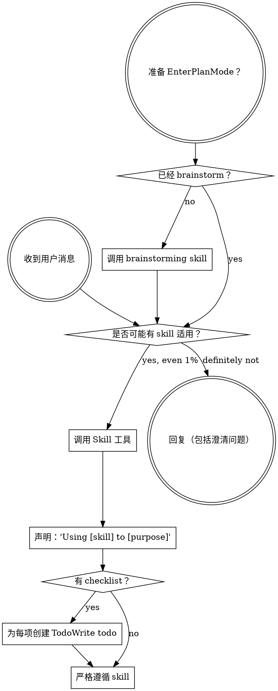

<SUBAGENT-STOP>
如果你是被派发来执行特定任务的 subagent，跳过本 skill。
</SUBAGENT-STOP>

<EXTREMELY-IMPORTANT>
如果你认为当前工作哪怕只有 1% 的概率适用某个 skill，你也绝对必须调用该 skill。

如果某个 skill 适用于你的任务，你没有选择。你必须使用它。

这不可协商。这不是可选项。你不能用任何理由绕过它。
</EXTREMELY-IMPORTANT>

## 指令优先级

Superpowers skills 会覆盖默认系统提示行为，但**用户指令始终优先**：

1. **用户的显式指令**（CLAUDE.md、GEMINI.md、AGENTS.md、直接请求）- 最高优先级
2. **Superpowers skills** - 在冲突处覆盖默认系统行为
3. **默认系统提示** - 最低优先级

如果 CLAUDE.md、GEMINI.md 或 AGENTS.md 说 "don't use TDD"，而某个 skill 说 "always use TDD"，遵循用户指令。用户拥有控制权。

## 如何访问 Skills

**在 Claude Code 中：**使用 `Skill` 工具。调用 skill 时，它的内容会被加载并呈现给你，直接遵循即可。绝不要用 Read 工具读取 skill 文件。

**在 Copilot CLI 中：**使用 `skill` 工具。Skills 会从已安装插件自动发现。`skill` 工具的工作方式与 Claude Code 的 `Skill` 工具相同。

**在 Gemini CLI 中：**Skills 通过 `activate_skill` 工具激活。Gemini 会在会话开始时加载 skill metadata，并在需要时按需激活完整内容。

**在其他环境中：**查看你平台的文档，了解 skills 如何加载。

## 平台适配

Skills 使用 Claude Code 工具名。非 CC 平台：查看 `references/copilot-tools.md`（Copilot CLI）、`references/codex-tools.md`（Codex）获取工具等价映射。Gemini CLI 用户会通过 GEMINI.md 自动加载工具映射。

# 使用 Skills

## 规则

**在任何回复或行动前，调用相关或被请求的 skills。**哪怕只有 1% 可能适用，也应该调用该 skill 检查。如果调用后发现 skill 不适合当前情况，就不需要使用它。

## 红旗

这些想法意味着停止，你在合理化：

| 想法 | 现实 |
|---------|---------|
| "This is just a simple question" | 问题也是任务。检查 skills。 |
| "I need more context first" | Skill 检查发生在澄清问题之前。 |
| "Let me explore the codebase first" | Skills 会告诉你如何探索。先检查。 |
| "I can check git/files quickly" | 文件缺少对话上下文。检查 skills。 |
| "Let me gather information first" | Skills 会告诉你如何收集信息。 |
| "This doesn't need a formal skill" | 如果 skill 存在，就使用它。 |
| "I remember this skill" | Skills 会演化。阅读当前版本。 |
| "This doesn't count as a task" | 行动 = 任务。检查 skills。 |
| "The skill is overkill" | 简单事会变复杂。使用它。 |
| "I'll just do this one thing first" | 做任何事之前先检查。 |
| "This feels productive" | 无纪律行动会浪费时间。Skills 防止浪费。 |
| "I know what that means" | 知道概念不等于使用 skill。调用它。 |

## Skill 优先级

多个 skill 可能适用时，按此顺序：

1. **先用流程 skill**（brainstorming、debugging）- 它们决定如何处理任务
2. **再用实现 skill**（frontend-design、mcp-builder）- 它们指导执行

"Let's build X" -> 先 brainstorming，再实现 skill。
"Fix this bug" -> 先 debugging，再领域特定 skill。

## Skill 类型

**刚性**（TDD、debugging）：严格遵循。不要绕开纪律。

**灵活**（patterns）：按上下文适配原则。

Skill 本身会告诉你它属于哪类。

## 用户指令

指令说明做什么，而不是怎么做。"Add X" 或 "Fix Y" 并不意味着可以跳过工作流。
