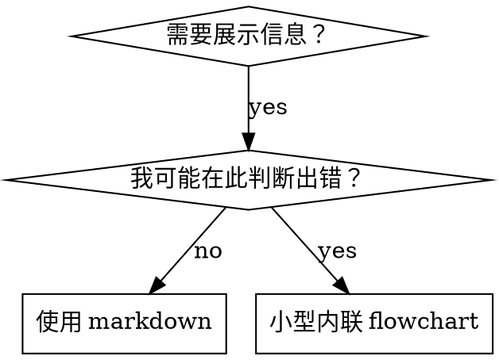

# 编写 Skills

## 概览

**编写 skills 就是把 Test-Driven Development 应用于流程文档。**

**个人 skills 位于 agent-specific 目录（Claude Code 为 `~/.claude/skills`，Codex 为 `~/.agents/skills/`）**

你编写测试用例（带 subagent 的压力场景），看它们失败（基线行为），编写 skill（文档），看测试通过（agents 遵守），然后重构（堵住漏洞）。

**核心原则：**如果你没有看见 agent 在没有 skill 时失败，就不知道这个 skill 是否教会了正确内容。

**必需背景：**使用本 skill 前，你必须理解 superpowers:test-driven-development。那个 skill 定义了基础 RED-GREEN-REFACTOR cycle。本 skill 将 TDD 应用于文档。

**官方指导：**Anthropic 官方 skill authoring 最佳实践见 anthropic-best-practices.md。本文档提供了额外的模式和指南，作为本 skill 中 TDD-focused 方法的补充。

## 什么是 Skill？

**Skill** 是用于成熟技术、模式或工具的参考指南。Skills 帮助未来的 Claude 实例找到并应用有效方法。

**Skills 是：**可复用技术、模式、工具、参考指南

**Skills 不是：**关于你某次如何解决问题的叙事

## Skill 的 TDD 映射

| TDD 概念 | Skill 创建 |
|-------------|----------------|
| **测试用例** | 带 subagent 的压力场景 |
| **生产代码** | Skill 文档（SKILL.md） |
| **测试失败（RED）** | Agent 在没有 skill 时违反规则（基线） |
| **测试通过（GREEN）** | Agent 在 skill 存在时遵守 |
| **重构** | 在保持遵守的同时堵住漏洞 |
| **先写测试** | 编写 skill 前运行基线场景 |
| **看它失败** | 记录 agent 使用的精确合理化 |
| **最小代码** | 编写 skill 来处理这些具体违规 |
| **看它通过** | 验证 agent 现在遵守 |
| **重构循环** | 找到新的合理化 -> 堵住 -> 重新验证 |

整个 skill 创建流程遵循 RED-GREEN-REFACTOR。

## 何时创建 Skill

**适合创建：**
- 这项技术对你来说并非直觉明显
- 你会在多个项目中再次引用它
- 模式广泛适用（不是项目专属）
- 其他人会受益

**不要创建：**
- 一次性解决方案
- 已有标准文档充分覆盖的常规实践
- 项目特定约定（放在 CLAUDE.md）
- 机械约束（如果能用 regex/validation 强制执行，就自动化；把文档留给需要判断的内容）

## Skill 类型

### Technique
带有可执行步骤的具体方法（condition-based-waiting、root-cause-tracing）

### Pattern
思考问题的方式（flatten-with-flags、test-invariants）

### Reference
API 文档、语法指南、工具文档（office docs）

## 目录结构


```
skills/
  skill-name/
    SKILL.md              # Main reference (required)
    supporting-file.*     # Only if needed
```

**扁平命名空间** - 所有 skills 都在一个可搜索的 namespace 中

**独立文件用于：**
1. **重型参考**（100+ 行）- API docs、完整语法
2. **可复用工具** - Scripts、utilities、templates

**内联保留：**
- 原则和概念
- 代码模式（< 50 行）
- 其他所有内容

## SKILL.md 结构

**Frontmatter（YAML）：**
- 两个必需字段：`name` 和 `description`（所有支持字段见 [agentskills.io/specification](https://agentskills.io/specification)）
- 总长度最多 1024 字符
- `name`：只使用字母、数字和连字符（不要括号、特殊字符）
- `description`：第三人称，只描述何时使用（不是它做什么）
  - 以 "Use when..." 开头，聚焦触发条件
  - 包含具体症状、情境和上下文
  - **绝不要总结 skill 的流程或工作流**（原因见 CSO 节）
  - 尽可能控制在 500 字符以内

```markdown
---
name: Skill-Name-With-Hyphens
description: Use when [specific triggering conditions and symptoms]
---

# Skill Name

## Overview
What is this? Core principle in 1-2 sentences.

## When to Use
[Small inline flowchart IF decision non-obvious]

Bullet list with SYMPTOMS and use cases
When NOT to use

## Core Pattern (for techniques/patterns)
Before/after code comparison

## Quick Reference
Table or bullets for scanning common operations

## Implementation
Inline code for simple patterns
Link to file for heavy reference or reusable tools

## Common Mistakes
What goes wrong + fixes

## Real-World Impact (optional)
Concrete results
```


## Claude Search Optimization（CSO）

**对发现至关重要：**未来的 Claude 需要找到你的 skill

### 1. 丰富的 Description 字段

**目的：**Claude 会读取 description 来决定针对给定任务加载哪些 skills。它要回答："我现在应该读这个 skill 吗？"

**格式：**以 "Use when..." 开头，聚焦触发条件

**关键：Description = 何时使用，不是 Skill 做什么**

Description 应该只描述触发条件。不要在 description 中总结 skill 的流程或工作流。

**为什么重要：**测试发现，当 description 总结 skill workflow 时，Claude 可能会遵循 description，而不是读取完整 skill 内容。一个写着 "code review between tasks" 的 description 会导致 Claude 只做一次 review，即使 skill 的 flowchart 清楚显示了两次 review（spec compliance，然后 code quality）。

当 description 改成只写 "Use when executing implementation plans with independent tasks"（不总结 workflow）后，Claude 才正确读取 flowchart 并遵循两阶段 review 流程。

**陷阱：**总结 workflow 的 descriptions 会创造 Claude 会走的捷径。Skill body 会变成 Claude 跳过的文档。

```yaml
# ❌ BAD: Summarizes workflow - Claude may follow this instead of reading skill
description: Use when executing plans - dispatches subagent per task with code review between tasks

# ❌ BAD: Too much process detail
description: Use for TDD - write test first, watch it fail, write minimal code, refactor

# ✅ GOOD: Just triggering conditions, no workflow summary
description: Use when executing implementation plans with independent tasks in the current session

# ✅ GOOD: Triggering conditions only
description: Use when implementing any feature or bugfix, before writing implementation code
```

**内容：**
- 使用具体 triggers、symptoms 和 situations，表明这个 skill 适用
- 描述**问题**（race conditions、inconsistent behavior），而不是**语言特定症状**（setTimeout、sleep）
- 除非 skill 本身是技术特定的，否则保持 triggers 技术无关
- 如果 skill 是技术特定的，在 trigger 中明确说明
- 使用第三人称（会注入到 system prompt）
- **绝不要总结 skill 的流程或工作流**

```yaml
# ❌ BAD: Too abstract, vague, doesn't include when to use
description: For async testing

# ❌ BAD: First person
description: I can help you with async tests when they're flaky

# ❌ BAD: Mentions technology but skill isn't specific to it
description: Use when tests use setTimeout/sleep and are flaky

# ✅ GOOD: Starts with "Use when", describes problem, no workflow
description: Use when tests have race conditions, timing dependencies, or pass/fail inconsistently

# ✅ GOOD: Technology-specific skill with explicit trigger
description: Use when using React Router and handling authentication redirects
```

### 2. 关键词覆盖

使用 Claude 会搜索的词：
- Error messages："Hook timed out"、"ENOTEMPTY"、"race condition"
- Symptoms："flaky"、"hanging"、"zombie"、"pollution"
- Synonyms："timeout/hang/freeze"、"cleanup/teardown/afterEach"
- Tools：实际命令、库名、文件类型

### 3. 描述性命名

**使用主动语态，动词优先：**
- ✅ `creating-skills`，不要 `skill-creation`
- ✅ `condition-based-waiting`，不要 `async-test-helpers`

### 4. Token 效率（关键）

**问题：**getting-started 和 frequently-referenced skills 会加载进每个对话。每个 token 都重要。

**目标字数：**
- getting-started workflows：每个 <150 词
- 频繁加载的 skills：总计 <200 词
- 其他 skills：<500 词（仍要简洁）

**技巧：**

**把细节移到工具 help：**
```bash
# ❌ BAD: Document all flags in SKILL.md
search-conversations supports --text, --both, --after DATE, --before DATE, --limit N

# ✅ GOOD: Reference --help
search-conversations supports multiple modes and filters. Run --help for details.
```

**使用交叉引用：**
```markdown
# ❌ BAD: Repeat workflow details
When searching, dispatch subagent with template...
[20 lines of repeated instructions]

# ✅ GOOD: Reference other skill
Always use subagents (50-100x context savings). REQUIRED: Use [other-skill-name] for workflow.
```

**压缩示例：**
```markdown
# ❌ BAD: Verbose example (42 words)
your human partner: "How did we handle authentication errors in React Router before?"
You: I'll search past conversations for React Router authentication patterns.
[Dispatch subagent with search query: "React Router authentication error handling 401"]

# ✅ GOOD: Minimal example (20 words)
Partner: "How did we handle auth errors in React Router?"
You: Searching...
[Dispatch subagent -> synthesis]
```

**消除冗余：**
- 不要重复交叉引用 skill 中已有的 workflow details
- 不要解释命令已经显而易见的内容
- 不要为同一个模式提供多个示例

**验证：**
```bash
wc -w skills/path/SKILL.md
# getting-started workflows: aim for <150 each
# Other frequently-loaded: aim for <200 total
```

**按你做什么或核心洞察命名：**
- ✅ `condition-based-waiting` > `async-test-helpers`
- ✅ `using-skills` 而不是 `skill-usage`
- ✅ `flatten-with-flags` > `data-structure-refactoring`
- ✅ `root-cause-tracing` > `debugging-techniques`

**动名词（-ing）适合流程：**
- `creating-skills`、`testing-skills`、`debugging-with-logs`
- 主动，描述你正在采取的动作

### 4. 交叉引用其他 Skills

**编写引用其他 skills 的文档时：**

只使用 skill 名称，并带明确 requirement markers：
- ✅ Good：`**REQUIRED SUB-SKILL:** Use superpowers:test-driven-development`
- ✅ Good：`**REQUIRED BACKGROUND:** You MUST understand superpowers:systematic-debugging`
- ❌ Bad：`See skills/testing/test-driven-development`（不清楚是否必需）
- ❌ Bad：`@skills/testing/test-driven-development/SKILL.md`（强制加载，消耗上下文）

**为什么不用 @ links：**`@` 语法会立即强制加载文件，在需要前就消耗 200k+ 上下文。

## Flowchart 使用



**Flowcharts 只用于：**
- 非显而易见的决策点
- 你可能过早停止的流程循环
- "何时使用 A vs B" 决策

**绝不要把 flowcharts 用于：**
- 参考材料 -> 用表格、列表
- 代码示例 -> 用 Markdown blocks
- 线性指令 -> 用编号列表
- 无语义标签（step1、helper2）

Graphviz 风格规则见 @graphviz-conventions.dot。

**为人工协作者可视化：**使用本目录中的 `render-graphs.js` 将 skill 的 flowcharts 渲染成 SVG：
```bash
./render-graphs.js ../some-skill           # Each diagram separately
./render-graphs.js ../some-skill --combine # All diagrams in one SVG
```

## 代码示例

**一个优秀示例胜过许多平庸示例**

选择最相关语言：
- 测试技术 -> TypeScript/JavaScript
- 系统调试 -> Shell/Python
- 数据处理 -> Python

**好示例：**
- 完整且可运行
- 注释良好，解释为什么
- 来自真实场景
- 清晰展示模式
- 可以直接改造使用（不是泛型模板）

**不要：**
- 用 5 种以上语言实现
- 创建填空模板
- 写牵强示例

你擅长移植，一个好示例就足够。

## 文件组织

### 自包含 Skill
```
defense-in-depth/
  SKILL.md    # Everything inline
```
适用：所有内容都能放下，不需要重型参考

### 带可复用工具的 Skill
```
condition-based-waiting/
  SKILL.md    # Overview + patterns
  example.ts  # Working helpers to adapt
```
适用：工具是可复用代码，而不仅是叙述

### 带重型参考的 Skill
```
pptx/
  SKILL.md       # Overview + workflows
  pptxgenjs.md   # 600 lines API reference
  ooxml.md       # 500 lines XML structure
  scripts/       # Executable tools
```
适用：参考材料太大，不适合内联

## 铁律（同 TDD）

```
没有先失败的测试，就不能写 skill
```

这适用于新 skills，也适用于编辑现有 skills。

测试前写 skill？删除它。重新开始。
未测试就编辑 skill？同样违规。

**没有例外：**
- "simple additions" 也不例外
- "just adding a section" 也不例外
- "documentation updates" 也不例外
- 不要保留未测试变更作为 "reference"
- 测试时不要 "adapt"
- 删除就是删除

**必需背景：**superpowers:test-driven-development skill 解释了为什么这很重要。同样原则适用于文档。

## 测试所有 Skill 类型

不同 skill 类型需要不同测试方法：

### 纪律执行型 Skills（规则/要求）

**示例：**TDD、verification-before-completion、designing-before-coding

**测试方式：**
- 学术问题：它们是否理解规则？
- 压力场景：压力下是否遵守？
- 多重压力组合：时间 + 沉没成本 + 疲惫
- 识别合理化并添加明确反制

**成功标准：**Agent 在最大压力下仍遵循规则

### Technique Skills（how-to guides）

**示例：**condition-based-waiting、root-cause-tracing、defensive-programming

**测试方式：**
- 应用场景：能否正确应用技术？
- 变体场景：能否处理边界情况？
- 缺失信息测试：指令是否有缺口？

**成功标准：**Agent 能成功把技术应用到新场景

### Pattern Skills（mental models）

**示例：**reducing-complexity、information-hiding concepts

**测试方式：**
- 识别场景：是否能识别模式何时适用？
- 应用场景：能否使用这个 mental model？
- 反例：是否知道何时不适用？

**成功标准：**Agent 正确识别何时/如何应用模式

### Reference Skills（documentation/APIs）

**示例：**API documentation、command references、library guides

**测试方式：**
- 检索场景：能否找到正确信息？
- 应用场景：能否正确使用找到的信息？
- 缺口测试：常见用例是否覆盖？

**成功标准：**Agent 找到并正确应用参考信息

## 跳过测试的常见合理化

| 借口 | 现实 |
|--------|---------|
| "Skill is obviously clear" | 对你清楚不等于对其他 agents 清楚。测试它。 |
| "It's just a reference" | 参考也可能有缺口和不清楚章节。测试检索。 |
| "Testing is overkill" | 未测试 skills 一定有问题。15 分钟测试节省数小时。 |
| "I'll test if problems emerge" | 问题 = agents 无法使用 skill。部署前测试。 |
| "Too tedious to test" | 测试比在生产中调试坏 skill 更不繁琐。 |
| "I'm confident it's good" | 过度自信保证会出问题。仍要测试。 |
| "Academic review is enough" | 阅读不等于使用。测试应用场景。 |
| "No time to test" | 部署未测试 skill 会浪费更多时间修它。 |

**这些都意味着：部署前测试。没有例外。**

## 防止 Skills 被合理化绕过

强制纪律的 skills（如 TDD）需要抵抗合理化。Agents 很聪明，会在压力下找到漏洞。

**心理学说明：**理解说服技术为什么有效，有助于你系统地应用它们。关于 authority、commitment、scarcity、social proof 和 unity principles 的研究基础（Cialdini, 2021；Meincke et al., 2025），见 persuasion-principles.md。

### 明确堵住每个漏洞

不要只陈述规则，要禁止具体绕法：

<Bad>
```markdown
Write code before test? Delete it.
```
</Bad>

<Good>
```markdown
Write code before test? Delete it. Start over.

**No exceptions:**
- Don't keep it as "reference"
- Don't "adapt" it while writing tests
- Don't look at it
- Delete means delete
```
</Good>

### 处理 "Spirit vs Letter" 论点

早早加入基础原则：

```markdown
**Violating the letter of the rules is violating the spirit of the rules.**
```

这会切断整类 "I'm following the spirit" 的合理化。

### 构建合理化表格

从基线测试中捕获合理化（见下方 Testing 节）。Agents 提出的每个借口都放进表格：

```markdown
| Excuse | Reality |
|--------|---------|
| "Too simple to test" | Simple code breaks. Test takes 30 seconds. |
| "I'll test after" | Tests passing immediately prove nothing. |
| "Tests after achieve same goals" | Tests-after = "what does this do?" Tests-first = "what should this do?" |
```

### 创建红旗列表

让 agents 在合理化时容易自检：

```markdown
## Red Flags - STOP and Start Over

- Code before test
- "I already manually tested it"
- "Tests after achieve the same purpose"
- "It's about spirit not ritual"
- "This is different because..."

**All of these mean: Delete code. Start over with TDD.**
```

### 为违规症状更新 CSO

在 description 中添加你将要违反规则时的症状：

```yaml
description: use when implementing any feature or bugfix, before writing implementation code
```

## Skills 的 RED-GREEN-REFACTOR

遵循 TDD cycle：

### RED：编写失败测试（基线）

在没有 skill 的情况下，用 subagent 运行压力场景。记录精确行为：
- 它们做了什么选择？
- 它们用了哪些合理化（逐字记录）？
- 哪些压力触发了违规？

这就是 "watch the test fail"。编写 skill 前，你必须看见 agents 自然会做什么。

### GREEN：编写最小 Skill

编写 skill，处理这些具体合理化。不要为假设场景添加额外内容。

用 skill 运行相同场景。Agent 现在应该遵守。

### REFACTOR：堵住漏洞

Agent 找到了新的合理化？添加明确反制。重新测试直到 bulletproof。

**测试方法：**完整测试方法见 @testing-skills-with-subagents.md：
- 如何编写压力场景
- 压力类型（time、sunk cost、authority、exhaustion）
- 系统化堵洞
- Meta-testing 技术

## 反模式

### ❌ 叙事示例
"In session 2025-10-03, we found empty projectDir caused..."
**为什么坏：**太具体，不可复用

### ❌ 多语言稀释
example-js.js、example-py.py、example-go.go
**为什么坏：**质量平庸、维护负担

### ❌ Flowcharts 中写代码
```dot
step1 [label="import fs"];
step2 [label="read file"];
```
**为什么坏：**无法复制粘贴，难读

### ❌ 泛型标签
helper1、helper2、step3、pattern4
**为什么坏：**标签应该有语义

## 停止：进入下一个 Skill 前

**写完任何 skill 后，必须停止并完成部署流程。**

**不要：**
- 批量创建多个 skills 而不逐个测试
- 当前 skill 未验证就进入下一个
- 因为 "batching is more efficient" 跳过测试

**下面的部署 checklist 对每个 skill 都是强制的。**

部署未测试 skills = 部署未测试代码。这违反质量标准。

## Skill 创建 Checklist（TDD 适配）

**重要：使用 TodoWrite 为下面每个 checklist item 创建 todo。**

**RED 阶段 - 编写失败测试：**
- [ ] 创建压力场景（纪律型 skills 需要 3+ 组合压力）
- [ ] 在没有 skill 时运行场景，逐字记录基线行为
- [ ] 识别合理化/失败中的模式

**GREEN 阶段 - 编写最小 Skill：**
- [ ] 名称只使用字母、数字、连字符（无括号/特殊字符）
- [ ] YAML frontmatter 含必需的 `name` 和 `description` 字段（最多 1024 字符；见 [spec](https://agentskills.io/specification)）
- [ ] Description 以 "Use when..." 开头，包含具体 triggers/symptoms
- [ ] Description 使用第三人称
- [ ] 全文包含搜索关键词（errors、symptoms、tools）
- [ ] 清晰 overview 和 core principle
- [ ] 处理 RED 中识别到的具体基线失败
- [ ] Code inline 或链接到独立文件
- [ ] 一个优秀示例（不要多语言）
- [ ] 带 skill 运行场景，验证 agents 现在遵守

**REFACTOR 阶段 - 堵住漏洞：**
- [ ] 从测试中识别新的合理化
- [ ] 添加明确反制（如果是纪律型 skill）
- [ ] 根据所有测试迭代构建合理化表格
- [ ] 创建红旗列表
- [ ] 重新测试直到 bulletproof

**质量检查：**
- [ ] 只有在决策非显而易见时使用小型 flowchart
- [ ] Quick reference table
- [ ] Common mistakes section
- [ ] 没有叙事 storytelling
- [ ] Supporting files 仅用于工具或重型参考

**部署：**
- [ ] Commit skill 到 git 并 push 到你的 fork（如果已配置）
- [ ] 如果广泛有用，考虑通过 PR 贡献回来

## 发现工作流

未来 Claude 如何找到你的 skill：

1. **遇到问题**（"tests are flaky"）
3. **找到 SKILL**（description 匹配）
4. **扫描 overview**（这相关吗？）
5. **阅读 patterns**（quick reference table）
6. **加载 example**（仅在实现时）

**为这个流程优化**，把可搜索词尽早、经常放入文档。

## 底线

**创建 skills 就是流程文档的 TDD。**

同样的铁律：没有先失败的测试，就不能写 skill。
同样的 cycle：RED（基线）-> GREEN（编写 skill）-> REFACTOR（堵住漏洞）。
同样的收益：质量更好、意外更少、结果更 bulletproof。

如果你对代码遵循 TDD，也要对 skills 遵循它。这是同一套纪律应用到文档。
